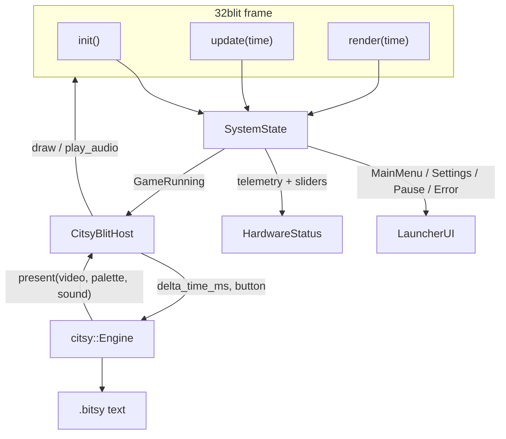
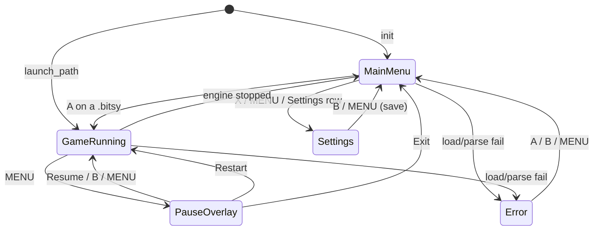

# System architecture & citsy integration

citsy-32blit is a **host**, not a second engine. The headless [citsy](https://github.com/TeriyakiGod/citsy) library parses `.bitsy` text, steps the world, and writes memory blocks. This repository implements `citsy::Host`, a 128×128 launcher, and RP2350 glue.



## Citsy engine & Bitsy data

### Loading a game

`scan_games()` in `game.cpp` builds a fixed-capacity list (`kMaxGames = 32`):

1. **Bundled ROM** — `assets.yml` packs `mossland.bitsy` and `sandbox.bitsy` as raw binaries. `File::add_buffer_file` registers them so 32blit `File` I/O works on-device.
2. **Filesystem / SD** — `list_files` on `""`, `"."`, and `"games/"` for `*.bitsy`. Titles are taken from the first non-comment Bitsy line (markup such as `{rbw}` stripped).
3. **Launch path** — `get_launch_path()` skips the menu and calls `start_game()` once.

`start_game()` reads the file into a `std::string`, then:

```cpp
g_engine.emplace(text);   // citsy::Engine parses .bitsy, throws ParseError
g_engine->start(g_host);  // Host::on_engine_ready
g_state = SystemState::GameRunning;
```

Teardown is `g_engine.reset()` plus `stop_audio()`. Restart re-parses the same path; there is no in-place rewind API.

Parse and I/O failures go to `SystemState::Error` rather than crashing the handheld.

### Simulation loop

While `GameRunning`, each `update(time)`:

1. Computes `dt` from 32blit `time` (ms).
2. If **MENU** was released → `PauseOverlay` (engine is not stepped).
3. If `!engine.is_running()` (Bitsy ending dismissed) → return to the launcher.
4. `g_host.set_delta(dt)` / `poll_input()` / `engine.update(g_host)` / `play_audio()`.

`poll_input()` maps 32blit buttons onto citsy logical buttons. **MENU is captured** by the launcher (`menu_captured_ = true`) so the engine’s “MENU released → stop” path cannot kill the game out from under the pause overlay.

| Bitsy / citsy | 32blit |
|---|---|
| Up / Down / Left / Right | D-pad |
| Ok (interact, advance dialog) | A **or** B |
| Menu | only if the launcher releases capture |

### Room render, tiles, avatar, dialog

citsy always composites a **128×128 colour-index** video block (`citsy::kVideoSize`). Rooms are 16×16 tiles of 8×8 pixels — the Bitsy world size — which fills the OLED exactly.

`CitsyBlitHost::present()`:

- Copies `video[]` into a persistent `video_` buffer.
- Builds `pens_[]` from the room palette (`Color {r,g,b}` → `blit::Pen`).
- If a dialog `TextboxView` is visible, stamps its glyph pixels into `video_` at `(textbox.x, textbox.y)`.
- Stores `sound1` / `sound2` for the audio mapper.

`draw()` then palettes `video_` onto `blit::screen` at 1× on the 128×128 panel. Avatar position, tile walls, items, and exits are entirely engine-side (`Engine::avatar_x/y`, `current_room_id()`, …). The host never interprets the map.

Dialog and endings stay in citsy (`dialog_active()`, `dialog_line()`, `ending_active()`). The player only forwards A/B as Ok so the script interpreter can advance pages.

See the [citsy Host API](https://teriyakigod.github.io/citsy/host/) for the buffer contract.

## State machine

`SystemState` in `game.hpp` is the explicit app state engine. Names in code vs. the design language:

| Design | `SystemState` | Entered from |
|---|---|---|
| `STATE_MAIN_MENU` | `MainMenu` | boot (unless launch path), Exit, error dismiss |
| `STATE_SETTINGS` | `Settings` | X, MENU, or the Settings row on the list |
| `STATE_GAME_RUNNING` | `GameRunning` | A on a game, Resume, Restart |
| `STATE_PAUSE_OVERLAY` | `PauseOverlay` | MENU while playing |
| *(load failure)* | `Error` | missing file / `ParseError` |

`init()`, `update()`, and `render()` switch on `g_state`. No heap allocation happens on those paths after the one-time game scan (string storage for titles lives on `GameEntry`).



### `STATE_MAIN_MENU`

`LauncherUI::draw_main_menu` is a vertical carousel in the 128×128 canvas:

- Status bar (see below).
- One row per game (cart icon hashed from the title, label, `01/NN ROM` or `SD`).
- A **Settings** gear row after the last game.
- Footer: `A play   X set   ^v`.

D-pad up/down uses hold-repeat (220 ms delay, 85 ms period) and a 1 px bounce on the selected row. **A** starts the selected `.bitsy` or opens Settings. Empty lists still show Settings and a “No .bitsy files” hint.

### `STATE_SETTINGS`

Two rows — **Volume** and **Bright** — as 96 px sliders (0–10). Left/Right nudge `HardwareStatus`; Up/Down swap rows. A compact `power USB` / `batt NN%` line repeats the ADC reading.

**B** or **MENU** writes save slot 0 and returns to the launcher. See [Hardware integration](hardware-integration.md) for PWM vs. OLED veil and `blit::volume`.

### `STATE_GAME_RUNNING`

Fullscreen Bitsy: no launcher chrome. `CitsyBlitHost::draw()` + `play_audio()`. Brightness veil still applies so the settings slider remains in effect in-game.

### `STATE_PAUSE_OVERLAY`

MENU while playing stops audio and freezes simulation (last `present()` frame stays on screen). A translucent black fill (`Pen(0,0,0,130)`) plus a 100×72 panel lists:

1. **Resume** — back to `GameRunning` (B or MENU also resume).
2. **Restart** — destroy and re-construct `Engine` from the same file.
3. **Exit** — `enter_main_menu()` (engine reset, audio off).

A confirms the highlighted row.

## Top system status bar

Drawn on menu and settings only (`LauncherUI::kStatusH = 13` px, inside the 12–14 px budget).

```text
 y = 0 … 12   panel fill   Pen(20, 24, 38)
 y = 13       1 px rule    accent dim
```

| Region | Contents |
|---|---|
| Left `x=3` | Title — `CITSY` on the launcher, `SETUP` in settings (truncated to 11 chars) |
| Centre `x=52` | Session clock `MM:SS` from `blit::now()` |
| Right `x=107` | Battery body 13×7 + 2 px nub; fill width = `percent × 11 / 100`. USB / unknown draws a 5 px lightning next to the nub |

Keep labels short — `minimal_font` is a 4–6 px variable-width face. Do not put paragraph text in the header; details belong on the selected card or the settings sliders.

On desktop, `LauncherUI::origin()` centres the 128×128 canvas in the 320×240 window and draws a 3 px bezel so the OLED layout is what you debug.

## File map

| File | Responsibility |
|---|---|
| `game.cpp` / `game.hpp` | `SystemState`, game scan, `init` / `update` / `render` |
| `launcher.cpp` / `launcher.hpp` | Status bar, list, sliders, pause panel, veil |
| `hardware.cpp` / `hardware.hpp` | ADC, PWM, `blit::volume`, save slot 0 |
| `host.cpp` / `host.hpp` | `citsy::Host` — input, `present`, blit, square-wave channels |
| `assets.yml` | Bundled `.bitsy` + splash/icon |
